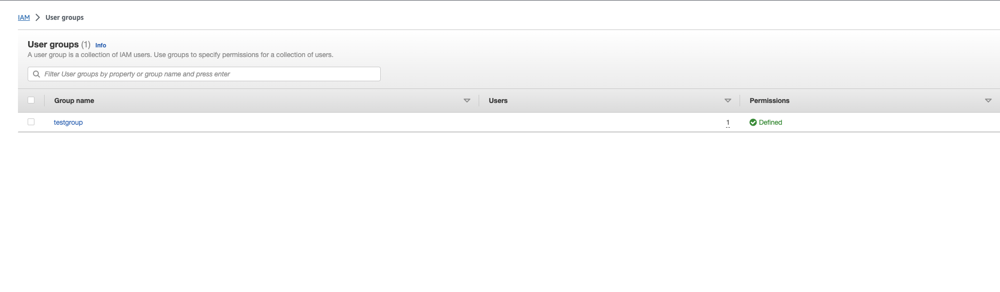
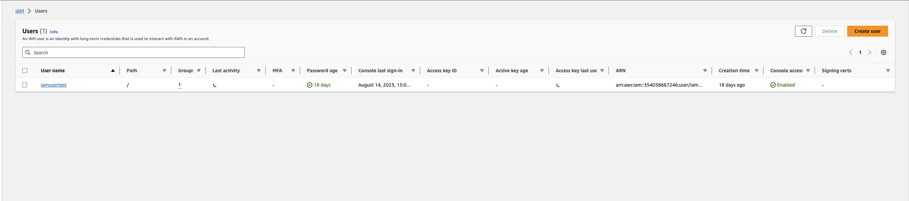
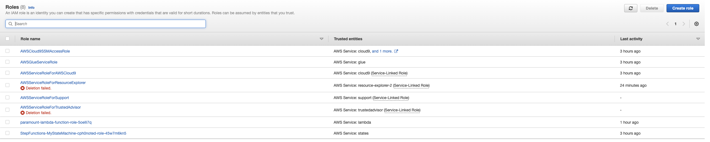
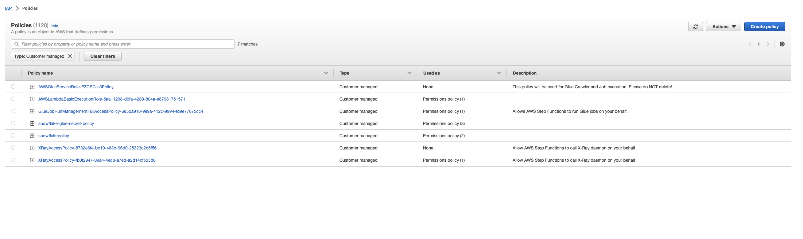
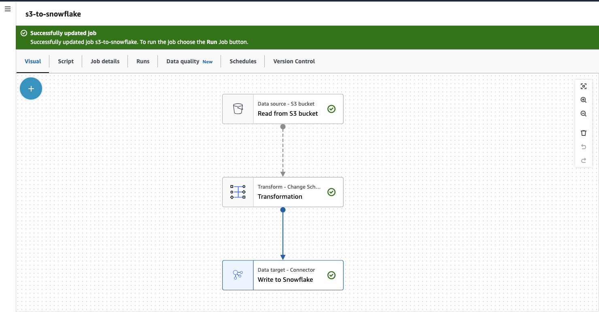
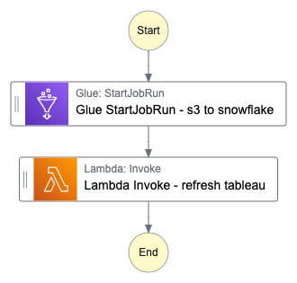

## Use-case - Tableau Datasource Refresh

A detailed explanation with code samples of a process that within the following environment:

1. We have a Snowflake instance in AWS.
2. We also have a Tableau server in AWS in the same region as Snowflake.
3. We have an enterprise Slack instance.
4. We have an ETL process that loads some data into a table called **mytable** in Snowflake in **mydb.myschema** schema. 

Trigger a refresh of a data source called mydatasource in project called myproject in Tableau as soon as step 4 above completes.
Once data source mydatasource is refreshed successfully, push a notification posted into a Slack channel in our instance **#mychannel**. On failure, it should create a service now incident to a group **mygroup**.

### Assumptions
1. The ETL process is executed using AWS Glue.
2. It is assumed that the ETL process is scheduled in AWS Step Functions using EventBridge to trigger at specified intervals.
3. Full data loads are triggered as part of the process.
4. Tableau is hosted on an EC2 instance, and it is both web hook and API enabled.
5. Additionally, Slack and ServiceNow are also webhook and API enabled.

### Pre-Requisites 
1. An AWS account has been set up.
2. Root user and IAM user "iamusertest" have been created for this activity. Please refer to the following screenshots: 
 and 
3. Create IAM role named "AWSGlueServiceRole" has been created to access AWS services. Please refer to 

4. The necessary policies have been attached to their respective roles. Please refer to 

### Tools/Services Used
1. **AWS Glue** is employed for the **ETL** process, which involves loading files from an **S3 bucket** into **Snowflake**'s **mytable.**
2. AWS Lambda functions are utilized to refresh **Tableau** and trigger/push notifications to **Slack** and **ServiceNow**.
3. AWS **Step Functions** are employed to automate the workflow in a sequential manner.

### Approach Implemented 

1. AWS Glue, configured with the script `s3-to-snowflake-job.py`, establishes a source connection to an S3 bucket for accessing source files. It also defines Snowflake as the destination using **Glue Connector 3.0**. Parameters are passed to the connector.

2. The Truncate DML is executed as a pre-action in the Snowflake destination before loading new data into **`mytable`**.

3. An AWS Lambda function named `table_datasource_refresh.py` contains Python code to refresh the **Tableau** data source. The following actions are performed:
   - Retrieval of **Project and Data Source IDs** based on provided Project and DataSource Names.
   - Signing into the **Tableau** service using a **personal access token**.
   - Sending a Slack notification to the #**mychannel** channel in case of any action failure.
   - Creates the ServiceNow incident in the case of failure occur during refresh
   - Utilizing Project ID and Data Source ID to trigger a data source refresh through the API.
4. Upon successful refresh, the lambda function **`slack_notification.py`** is invoked with the required parameters to send a notification to the **`#mychannel`**. 
5. In case of a refresh failure, the lambda function **`ServiceNow_incident.py`** is invoked with the required parameters to log an incident in the **`mygroup`** and additionally sends a failure notification to **`#mychannel`**.
6. These steps are consolidated within the Step function, ensuring sequential execution  

### Further Improvements
1. Implement Merge Logic or Slowly Changing Dimensions (SCD) within AWS Glue to handle incremental loads.
2. Implement triggers to schedule the complete workflow.
3. Develop a Python script to manage the ETL process and setup event trigger as soon as the source file is available in the S3 storage bucket.
